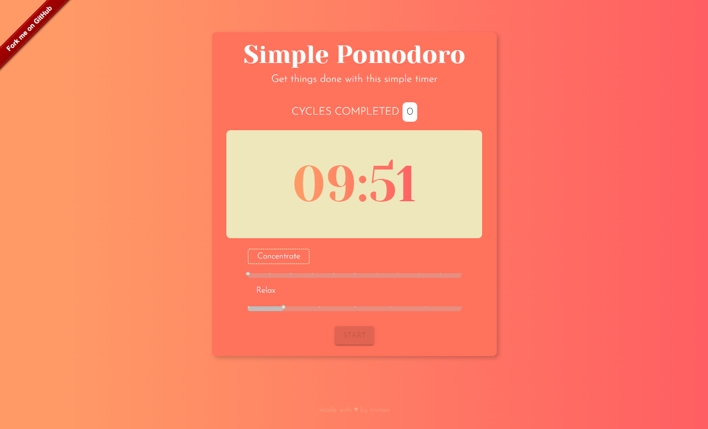
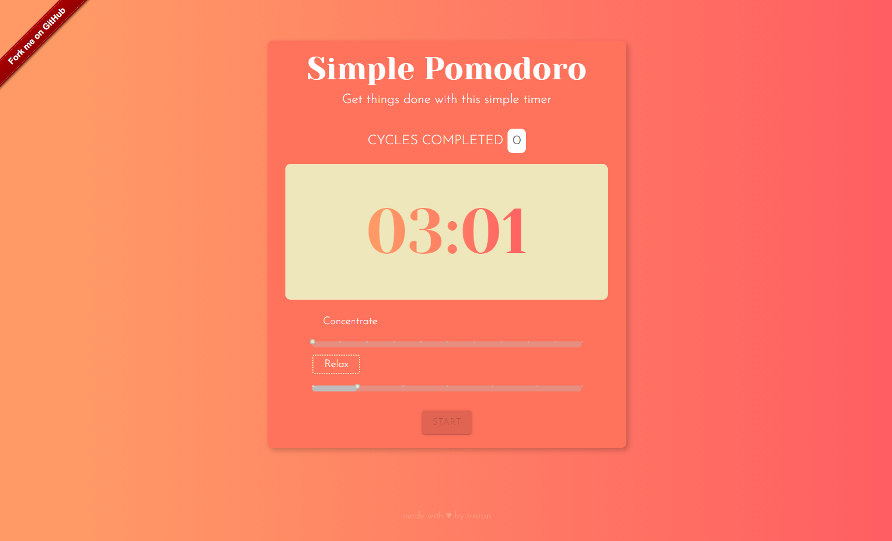
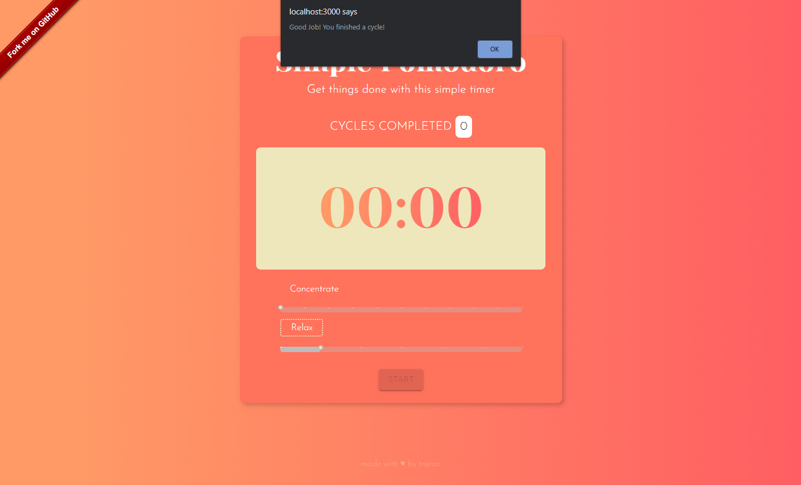
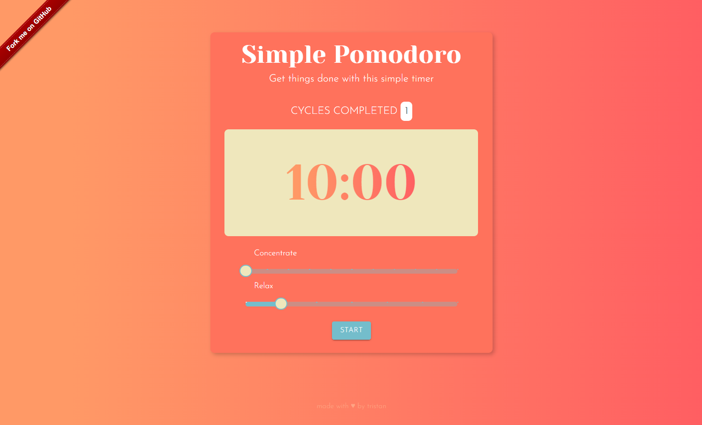

# Simple Pomodoro Timer App

## Description
This repository contains files for the simple pomodoro app created using React JS

## Usage
1. Use the slider to modify CONCENTRATE and REST time settings
2. Click the START button to begin CONCENTRATE Phase

**Note:** The app will automatically proceed to the REST Phase once the CONCENTRATE Phase is done. 

## Screenshots

## Live Demo
The Simple Pomodoro React App is live here: [http://simple-pomodoro.decoroustea.xyz/](http://simple-pomodoro.decoroustea.xyz/)

## How to Contribute
1. Clone repo and create a new branch: `$ git checkout https://github.com/tristanjoshuaalba/simple-pomodoro -b name_for_new_branch`
2. Make changes and test
3. Submit Pull Request with comprehensive description of changes

## Acknowledgements
- ZTM Study Group